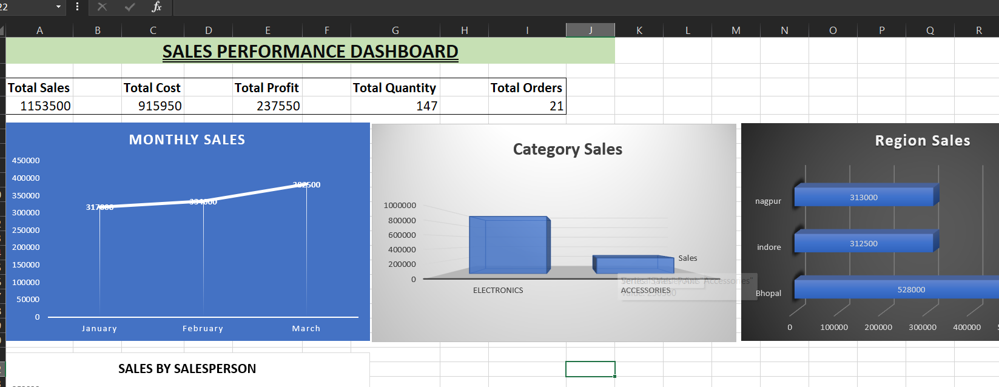

# Sales Performance Dashboard

## 📊 Project Overview

This is an Excel-based Sales Performance Dashboard created to analyze and visualize sales data.

## 📈 Dashboard Features

- Total Sales
- Total Cost
- Total Profit
- Total Quantity
- Total Orders
- Monthly Sales Analysis
- Category-wise Sales
- Region-wise Sales
- Salesperson-wise Sales
## 📊 Dashboard Preview

## 🛠️ Tools Used

- Microsoft Excel
- Excel Formulas
- Charts
- Data Analysis
- Dashboard Design

## 🎯 Project Objective

The main objective of this project is to analyze sales performance and present important business information through an easy-to-understand interactive dashboard.

## 📁 Project File

The Excel dashboard is available in this repository:

`Sales_Performance_Dashboard.xlsx`
